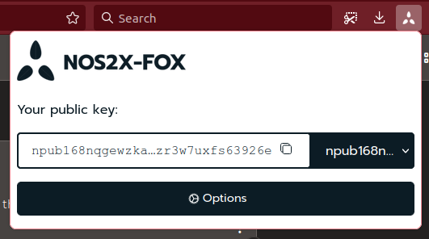
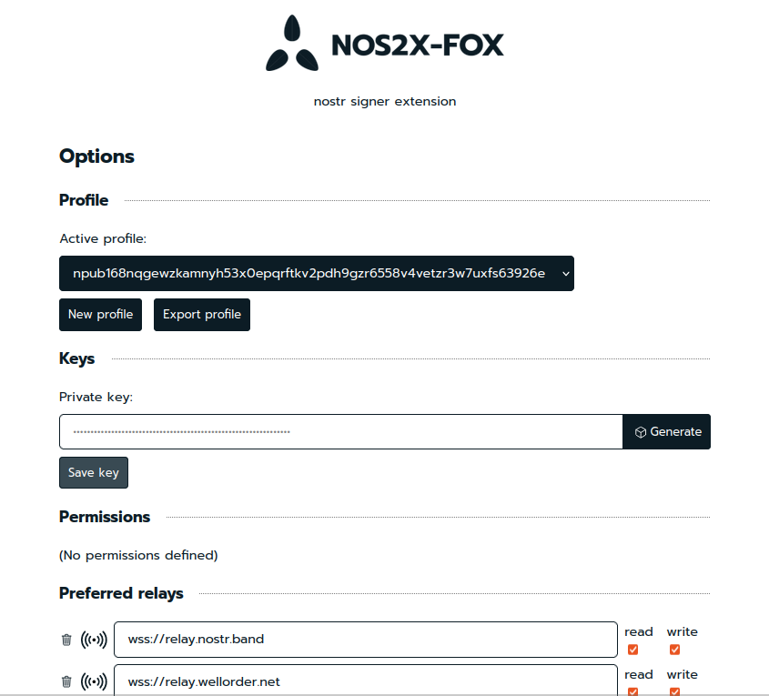
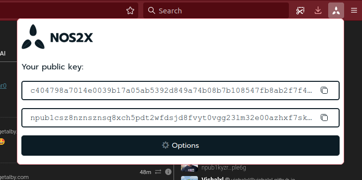
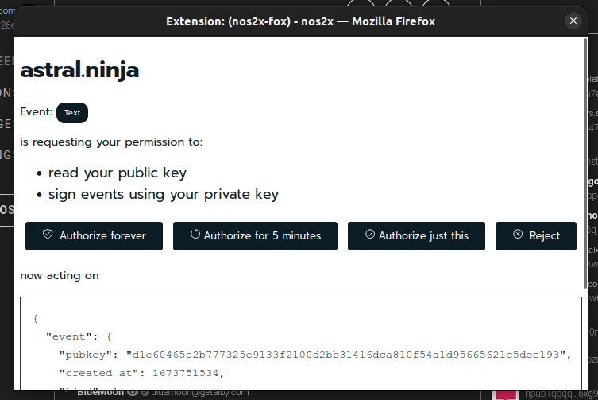

# nos2x-fox (nos2x for Forefox)
notes and other stuff signed by an extension

This is a fork from https://github.com/fiatjaf/nos2x focused on Firefox and related browsers.

## Nostr Signer Extension

This allows you to sign [Nostr](https://github.com/fiatjaf/nostr) events on web-apps without having to give them your keys.

It provides a `window.nostr` object which has the following methods:

```
async window.nostr.getPublicKey(): string // returns your public key as hex
async window.nostr.signEvent(event): Event // returns the full event object signed
async window.nostr.getRelays(): { [url: string]: RelayPolicy } // returns a map of relays
async window.nostr.nip04.encrypt(pubkey, plaintext): string // returns ciphertext+iv as specified in nip04
async window.nostr.nip04.decrypt(pubkey, ciphertext): string // takes ciphertext+iv as specified in nip04
```

## Install

* By yourself from file: look into [Releases](https://github.com/diegogurpegui/nos2x-fox/releases)
* From the site [Firefox Add-on](https://addons.mozilla.org/en-US/firefox/addon/nos2x-fox/)

## Develop

To run the plugin from this code:

```
$ git clone https://github.com/diegogurpegui/nos2x-fox
$ cd nos2x-fox
$ yarn install
$ yarn run build
```

After you build the extension, follow these steps:
1. Open Firefox
2. Go to about:debugging
3. Click on "This Firefox" on the left
4. Click on "Load Temporary Add-on..."
5. Select any file from the `dist/` folder of the extension


## Screenshots






---

## License and Credits

LICENSE: public domain.
Original work by [fiatjaf](https://github.com/fiatjaf).

Design taken from [Flydexo](https://github.com/Flydexo). See https://github.com/fiatjaf/nos2x/pull/15

Icons from [IonIcons](https://ionic.io/ionicons).